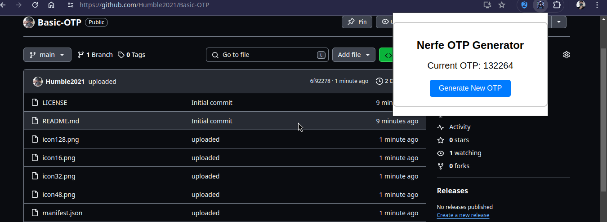

# Basic-OTP

This is a simple example of a browser extension. Its main function is to display OTPs and provide a template for creating similar extensions.

I've saved it as a personal template for future use.

